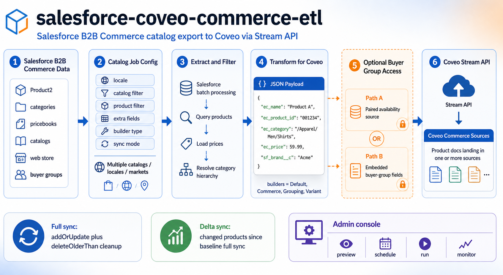
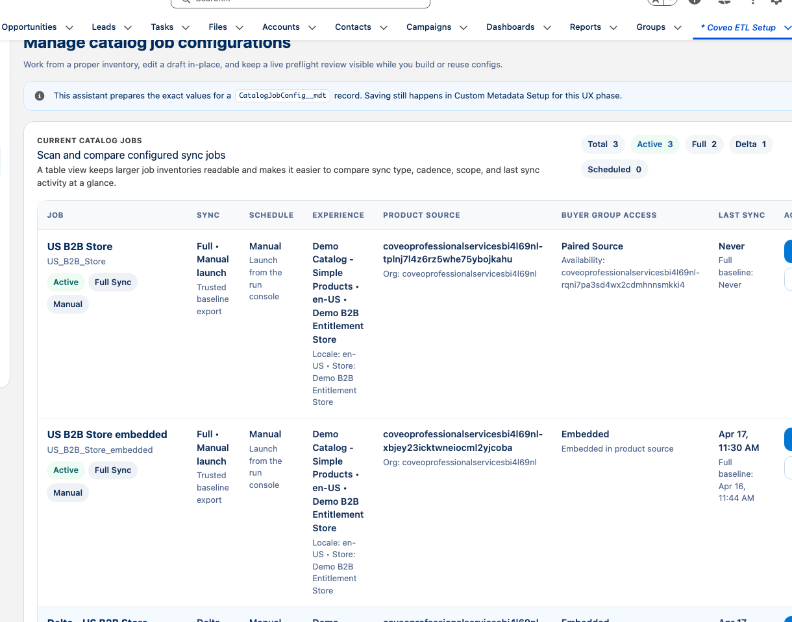
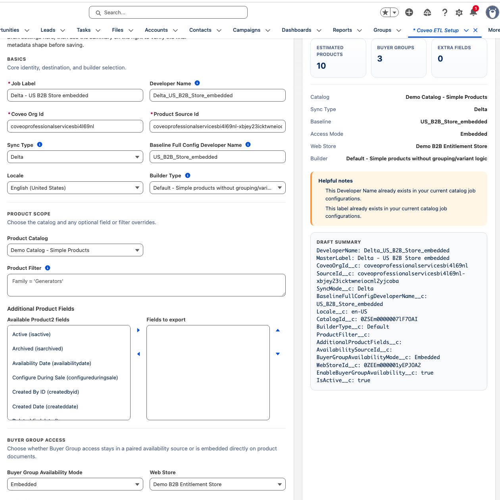
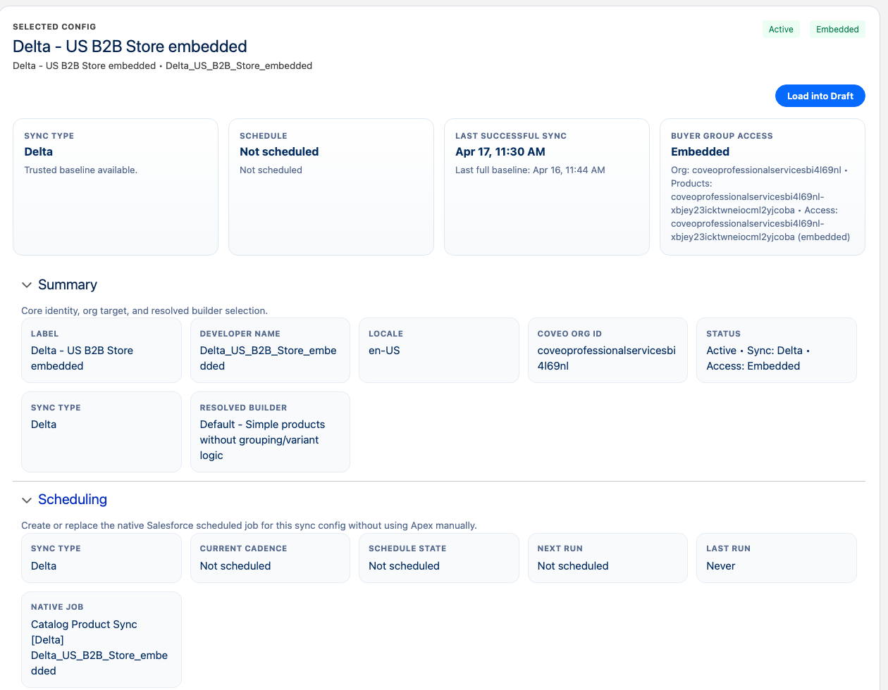
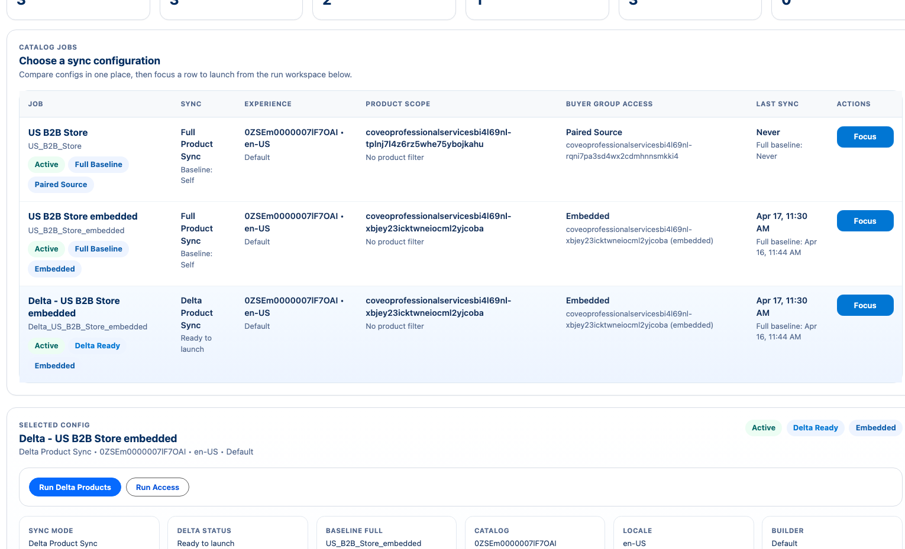
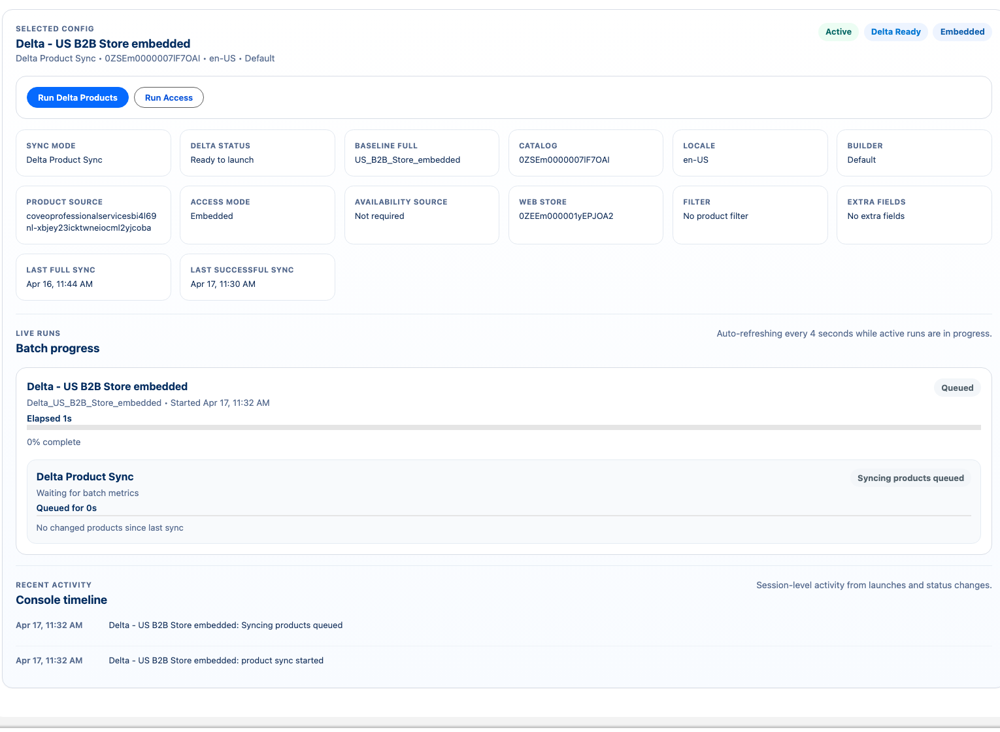

# **salesforce-coveo-commerce-etl**

[](https://developer.salesforce.com/docs/atlas.en-us.apexcode.meta/apexcode/)
[](https://developer.salesforce.com/tools/sfdxcli)

[](#license)
[](CONTRIBUTING.md)

> **A Salesforce SFDX starter kit for exporting enriched commerce catalog data to Coveo using the Stream API.**
> Supports multiple catalogs, dynamic product filters, dynamic Product2 fields, B2B Commerce category hierarchies, optional Buyer Group availability exports, and a sleek Salesforce LWC admin console.

---

# 📦 Overview

This project provides an **unlocked Salesforce package** for direct installation, plus a **metadata deployment package** for source-based deployments. It extracts product data from Salesforce and pushes it to **Coveo Commerce Catalog sources** using the **Stream API** (`addOrUpdate` / `addOrMerge`).



It includes:

- A flexible **Catalog Export Batch** implementation
- Support for **multiple Coveo catalog sources** (one per locale or market)
- **Multi-pricebook shared catalogs** with explicit pricebook or Web Store resolution
- Trusted **Full** and **Delta** product sync modes with resolved-target baselines
- Dynamic **Product2 filtering** (SOQL WHERE clause per catalog)
- Dynamic **field enrichment** via Product2 fields configured in CMDT
- Correct **Commerce payload format** (flat items, objecttype, ec\_\* fields)
- **Category hierarchy resolution** using B2B Commerce’s ProductCategory model
- Optional **Buyer Group availability exports** to a paired Coveo Availability source
- Full **delete-older-than** cleanup via Stream API
- Native Salesforce **scheduling controls** for full and delta sync jobs
- Optional **chained scheduling** so multiple configs share scheduled Apex slots
- A modern **LWC setup workspace and run center** for drafting, scheduling, and monitoring jobs
- SafeFieldUtil for fault-tolerant dynamic field access
- Scratch-org scripts + seeded sample data

---

## ⚠️ Prerequisites: Salesforce B2B Commerce Dependency

This package **requires Salesforce B2B Commerce** to be enabled in the target org (Scratch Org, Sandbox, or Production).
The package references standard Commerce objects such as:

- `ProductCategory`
- `ProductCategoryProduct`
- `ProductCatalog`
- `Product2` (standard, used for products)
- `Pricebook2` / `PricebookEntry` (standard pricing structure)

Because these objects are part of **Salesforce B2B Commerce**, the following must be true:

---

### The org must have B2B Commerce licensed and enabled

To verify, check in **Setup → Object Manager** that the following objects exist:

- **ProductCategory**
- **ProductCategoryProduct**
- **ProductCatalog**

If these objects are missing, the org is **not Commerce-enabled**.

## 📥 Installation

### Current Version: 1.3.3

> **Released:** 2026-06-22
> **Package Version ID:** `04tak000000UmOzAAK`

### Option 1: Install via Unlocked Package (Recommended)

This library is distributed as an [Unlocked Package](https://developer.salesforce.com/docs/atlas.en-us.sfdx_dev.meta/sfdx_dev/sfdx_dev_unlocked_pkg_install_pkg.htm). You can install it directly into your Salesforce environments.

#### Install via Package Links

- **Production / Developer Org:**
  [https://login.salesforce.com/packaging/installPackage.apexp?p0=04tak000000UmOzAAK](https://login.salesforce.com/packaging/installPackage.apexp?p0=04tak000000UmOzAAK)

- **Sandbox:**
  [https://test.salesforce.com/packaging/installPackage.apexp?p0=04tak000000UmOzAAK](https://test.salesforce.com/packaging/installPackage.apexp?p0=04tak000000UmOzAAK)

#### Install Using Salesforce CLI

```bash
sf package install --package 04tak000000UmOzAAK --target-org <your-org-alias> --wait 10
```

#### Optional: Compile Only the Package's Apex Code

```bash
sf package install --apex-compile package --package 04tak000000UmOzAAK --target-org <your-org-alias> --wait 10
```

After installation, assign the permission set:

```bash
sf org assign permset --name CoveoETL_Admin --target-org <your-org-alias>
```

### Option 2: Deploy via Metadata Package

1. **Download the latest release:**

   ```bash
   curl -L -o coveo-etl.zip "https://github.com/Coveo-Turbo/salesforce-coveo-commerce-etl/releases/download/v1.3.3/salesforce-coveo-commerce-etl-v1.3.3.zip"
   unzip coveo-etl.zip -d coveo-etl
   ```

2. **Deploy to your Salesforce org:**

   ```bash
   sf project deploy start --metadata-dir coveo-etl --target-org <your-org-alias>
   ```

3. **Assign the permission set:**
   ```bash
   sf org assign permset --name CoveoETL_Admin --target-org <your-org-alias>
   ```

### Option 3: Deploy from Source

1. **Clone this repository:**

   ```bash
   git clone https://github.com/Coveo-Turbo/salesforce-coveo-commerce-etl.git
   cd salesforce-coveo-commerce-etl
   ```

2. **Deploy to your org:**

   ```bash
   sf project deploy start --target-org <your-org-alias>
   ```

3. **Assign the permission set:**
   ```bash
   sf org assign permset --name CoveoETL_Admin --target-org <your-org-alias>
   ```

### Post-Installation Setup

After installation, complete the following steps:

1. **Configure Named Credential:**
   - Navigate to **Setup → Named Credentials**
   - Create or update the `Coveo_Push` Named Credential
   - Set the URL to your Coveo Push API endpoint (e.g., `https://api.cloud.coveo.com/push/v1`)

2. **Configure External Credential with API Key:**
   - Navigate to **Setup → External Credentials**
   - Find or create `CoveoPushAuthCred`
   - Add an **Authentication Parameter** named `API_KEY` with your Coveo API Key value

3. **Configure Catalog Jobs:**
   - Go to **Setup → Custom Metadata Types → Catalog Job Configurations**
   - Create configuration records for each catalog you want to export

4. **Access the Admin Console:**
   - Navigate to `/lightning/n/Coveo_ETL_Setup` in your Salesforce org

For detailed configuration instructions, see the [Configuration](#%EF%B8%8F-configuration) section below.

---

# 🚀 Features

### 🗂️ Multi-Catalog Config

Use Custom Metadata (`CatalogJobConfig__mdt`) to define multiple catalogs:

- Coveo Org ID
- Source ID
- Locale
- **Catalog ID** (`CatalogId__c`) - Filters products to a specific ProductCatalog
- Product filters (`ProductFilter__c`) - Additional SOQL WHERE clause filters
- Additional Product2 fields (`AdditionalProductFields__c`)
- Builder Type (`BuilderType__c`) - Determines how product grouping/variants are handled
- (Optional) paired Availability source (`AvailabilitySourceId__c`) for Buyer Group visibility
- (Optional) Web Store ID (`WebStoreId__c`) used to resolve Buyer Groups
- (Optional) explicit Pricebook IDs (`PricebookIds__c`) for a scoped price export with legacy raw keys
- (Optional) Shared Catalog Web Store IDs (`WebStoreIds__c`) for automatic pricebook resolution and multi-store Buyer Group availability
- (Optional) `EnableBuyerGroupAvailability__c` flag to turn on the availability export

### 🔎 Per-Catalog Product Filtering

#### Filter by Salesforce ProductCatalog

Set the `CatalogId__c` field to the Salesforce ProductCatalog ID. This automatically filters products to only those associated with the catalog via ProductCategory → ProductCategoryProduct relationships:

```
CatalogId__c: a0X5g000002AbCDEAZ
```

#### Additional Dynamic Filters

Each catalog can also define its own **SOQL WHERE** clause (without the WHERE keyword) for additional filtering:

```txt
Family = 'Generators' AND Locale__c = 'en_US'
```

These filters work in combination with the CatalogId filter when both are specified.

### ➕ Dynamic Field Enrichment

Customers can specify which Product2 fields should be exported:

```
Brand__c, Color__c, Gender__c
```

These become flat metadata fields in the payload:

```json
"sf_brand__c": "Acme",
"sf_color__c": "Blue"
```

### 🏷️ Correct Commerce Payload Format

Each item sent to Coveo looks like:

```json
{
  "objecttype": "Product",
  "documentId": "product://SKU123",
  "ec_name": "GenWatt 200kW",
  "ec_product_id": "SKU123",
  "ec_category": ["Generators", "Generators|Diesel", "Generators|Diesel|200kW"],
  "ec_price": 12999.99,
  "sf_brand__c": "Coveo Power"
}
```

### 🧠 Safe Field Access

`SafeFieldUtil` prevents Apex errors:

- Missing fields → safe `null`
- Unqueried fields → safe `null`
- Dynamic enrichment support
- Org-agnostic and customer-safe

### 🌳 Full Category Hierarchy

We resolve B2B Commerce category chains:

- `ProductCategoryProduct`
- `ProductCategory`
- Parent categories up to root
- Producing arrays like:

```json
[
  "Tools",
  "Tools|Power Tools",
  "Tools|Power Tools|Drills",
  "Tools|Power Tools|Drills|Cordless"
]
```

### 🔁 Stream API Support

Supports:

- `addOrUpdate` — full updates
- `addOrMerge` — incremental updates when supported by the downstream workflow
- `deleteOlderThan` cleanup for trusted full baseline exports
- `stream/deleteolderthan` — full replacement cleanup
- File container upload (S3 PUT)
- OrderingId extraction

### 🪄 Full And Delta Product Syncs

Each `CatalogJobConfig__mdt` record now supports a `SyncMode__c`:

- `Full` establishes the trusted catalog baseline and keeps the full replacement behavior.
- `Delta` re-exports only changed root products for the resolved export target.

Delta jobs are protected by runtime sync state:

- A successful full sync must exist before a delta job can run.
- Delta jobs use the last successful sync watermark for the resolved target.
- Delta jobs skip `deleteOlderThan` and only refresh changed product families.

### ⏰ Native Scheduling

The setup workspace can create or replace native Salesforce scheduled jobs for each catalog config:

- Weekly full syncs to refresh the trusted baseline
- Hourly delta syncs to keep the catalog current between baseline runs
- Visible cadence, next run, last run, and schedule state without manual Apex

Multiple active configs with the same sync mode can also be grouped into an opt-in **chained schedule**. One native scheduled job launches a queueable chain, and each queueable transaction launches one config. This reduces scheduled Apex slot usage without changing or removing existing per-config schedules.

Minute-based chain cadences are sharded into at most four shared jobs per hour. Hourly and weekly chain cadences use one native scheduled job. Chaining is launch-sequential: it does not wait for one config's batch to finish before launching the next config.

### 💲 Shared Catalog Pricebook Scope

A catalog config can scope prices in either of two ways:

1. `PricebookIds__c`: an explicit CSV of `Pricebook2` IDs.
2. `WebStoreIds__c`: a CSV of `WebStore` IDs whose pricebooks are resolved through `WebStorePricebook`.

Explicit pricebooks take precedence when both fields are populated. Both explicit and Web Store-resolved scopes preserve the legacy raw price-key contract so existing consumers do not need different lookup logic based on how the scope was configured.

For pricing, `WebStoreIds__c` is a **pricebook selector**, not part of the price identity. The resolver:

1. Finds every `Pricebook2` linked to each configured store through `WebStorePricebook`.
2. Builds the set union of those Pricebook IDs.
3. Removes duplicates when multiple stores share the same Pricebook.
4. Exports only prices from that resolved set.

The Web Store ID is not added to `ec_price` keys. A `WebStorePricebook` association does not create a store-specific price: the price still belongs to its Pricebook Entry and optional Product Selling Model. All scoped exports therefore use the existing raw key formats:

- `<Pricebook2Id>`
- `<Pricebook2Id>:<ProductSellingModelId>`

For example, suppose Store A uses the Shared and US Pricebooks, while Store B uses the same Shared Pricebook and a CA Pricebook:

```txt
Store A -> 01s_SHARED, 01s_US
Store B -> 01s_SHARED, 01s_CA
Union   -> 01s_SHARED, 01s_US, 01s_CA
```

The Shared Pricebook is emitted once, not once per store:

```json
{
  "ec_price": {
    "01s_SHARED": 99.99,
    "01s_SHARED:0jP_MONTHLY": 8.99,
    "01s_US": 104.99,
    "01s_US:0jP_MONTHLY": 9.49,
    "01s_CA": 139.99,
    "01s_CA:0jP_MONTHLY": 12.49
  }
}
```

When both scope fields are blank, legacy behavior is preserved: all active prices are considered, the Standard Pricebook key remains `""`, and other pricebooks use raw Salesforce IDs. A configured scope that resolves to no pricebooks exports no prices; it never falls back to every pricebook.

### 👥 Buyer Group Availability Export

When `EnableBuyerGroupAvailability__c` is turned on, the package can export a second Stream payload to a paired Availability source. Each Salesforce Buyer Group becomes one `Availability` item, and its `ec_available_items` list contains the entitled product identifiers for the configured store scope. Use `WebStoreIds__c` to union Buyer Groups across multiple stores; when it is blank, the existing singular `WebStoreId__c` remains the fallback.

Buyer Groups with no entitled products are still exported with an empty `ec_available_items` array so a full refresh can safely clear stale availability state from Coveo.

This supports the hybrid Coveo pattern where:

- the main catalog source stores products and variants
- the paired availability source stores Buyer Group visibility
- search tokens filter on `@ec_availability_id`

### 🧰 LWC Admin Console

A modern Experience-enabled admin UI that:

- Compares setup and run-center job inventories in full-width tables
- Supports guided full and delta job drafting with live preflight review
- Exposes last successful full and delta sync state directly in the UI
- Lets admins schedule native Salesforce jobs without opening Apex
- Tracks live batch progress and recent activity in the run center

---

# 📁 Project Structure

```
salesforce-coveo-commerce-etl/
├── force-app/
│   ├── main/default/
│   │   ├── classes/
│   │   │   ├── ProductCatalogExportBatch.cls
│   │   │   ├── CatalogJsonBuilderCommerce.cls
│   │   │   ├── CatalogJsonBuilderDefault.cls
│   │   │   ├── CatalogJsonBuilderGrouping.cls
│   │   │   ├── CatalogJsonBuilderVariant.cls
│   │   │   ├── CatalogJsonBuilderGroupingWithVariants.cls
│   │   │   ├── ICatalogJsonBuilder.cls
│   │   │   ├── CatalogJsonBuilderFactory.cls
│   │   │   ├── SafeFieldUtil.cls
│   │   │   ├── CoveoStreamClient.cls
│   │   │   ├── CoveoDeleteOlderThan.cls
│   │   │   └── CatalogJobRunner.cls
│   │   ├── lwc/
│   │   │   └── catalogJobConsole/
│   │   ├── objects/
│   │   │   └── CatalogJobConfig__mdt/
│   │   ├── namedCredentials/
│   │   ├── remoteSiteSettings/
│   │   ├── permissionsets/
│   │   └── customMetadata/
├── data/
│   ├── commerce-plan.json
│   ├── (Other data files...).json
│   └── seedPrices.apex
├── scripts/
│   ├── orgInit.sh
│   └── reset-commerce-data.sh
└── README.md
```

---

# 🔧 Setup

## Create scratch org, push source, import sample data

```
npm run setup:org
```

## Create a B2B scratch org with Buyer Group entitlement demo data

```bash
npm run setup:org:b2b
```

Pass a custom alias if needed:

```bash
npm run setup:org:b2b -- my-alias
```

## Optional: seed Buyer Group availability demo data manually

After the sample catalog data is loaded, seed a minimal B2B Commerce entitlement model:

```bash
bash scripts/seed-buyer-group-availability.sh <alias>
```

This creates:

- one demo `WebStore`
- three demo `BuyerGroup` records
- three `CommerceEntitlementPolicy` records
- store-to-buyer-group links
- buyer-group-to-policy links
- entitlement links for every SKU in `Demo Catalog - Simple Products`
- a limited subset of the first three simple-catalog SKUs for the limited group

The script prints the created `WebStoreId` and Buyer Group ids. Use that `WebStoreId` in `CatalogJobConfig__mdt.WebStoreId__c`, set `EnableBuyerGroupAvailability__c = true`, and add your Coveo `AvailabilitySourceId__c`.

---

# 🔧 Configuration Landing Page

After installing the package, use the **Coveo Commerce ETL Setup** page to configure your integration in three simple steps:

## Access the Configuration Page

Navigate to one of the following URLs in your Salesforce org:

- **Tab URL:** `/lightning/n/Coveo_ETL_Setup`
- **App Page URL:** `/lightning/page/setup/Coveo_Commerce_ETL_Setup`

Or search for "Coveo ETL Setup" in the App Launcher.

## Configuration Steps

### Step 1 – Connect to Coveo (Named Credential)

The setup page displays the status of the `Coveo_Push` Named Credential and provides guidance on configuring it. **The status will only show `Configured` when both the Named Credential exists AND the API_KEY authentication parameter is present.**

1. Go to **Setup → Named Credentials**
2. Find or create the `Coveo_Push` Named Credential
3. Set the **URL** to your Coveo Push API endpoint (e.g., `https://api.cloud.coveo.com/push/v1`)
4. Go to **Setup → External Credentials** and find `CoveoPushAuthCred`
5. Add an **Authentication Parameter** named `API_KEY` with your Coveo API Key value
6. Assign the permission set `CoveoETL_Admin` to grant access

Use the **Test Connection** button to verify your configuration.

### Step 2 – Configure Catalog Jobs

The setup page now provides a complete job workspace around `CatalogJobConfig__mdt`:

1. Compare full and delta configs in a table-first inventory
2. Build or revise a guided draft with `Sync Type`, baseline full config, catalog, filters, and Buyer Group access mode
3. Review live preflight details, sync readiness, and last successful sync timestamps before saving
4. Configure native Salesforce scheduling for the selected job without using Apex manually
5. Optionally group same-mode active configs into a shared chained schedule

### Step 3 – Advanced Builder Settings

Select which `ICatalogJsonBuilder` implementation is active. The default is `CatalogJsonBuilderCommerce`. To use a custom builder:

1. Create an Apex class implementing `ICatalogJsonBuilder`
2. Deploy it to your org
3. Update the `CatalogJsonBuilderMapping__mdt.Active` record with your class name

If a custom builder writes a custom `ec_product_id` and you also use Buyer Group availability export, implement the optional `ICatalogProductIdentityProvider` interface as well so `ec_available_items` stays aligned with the product catalog payload.

## Setup Workspace Highlights

### Catalog Job Inventory

The `Catalog Jobs` panel is optimized for larger inventories and shows sync type, schedule readiness, experience scope, Buyer Group access mode, and last sync state in one place.



### Guided Job Draft

The guided draft now supports full and delta configuration directly in the setup page, including `Sync Type`, `Baseline Full Config Developer Name`, catalog scope, product filters, and embedded versus paired Buyer Group access.



### Native Scheduling

Each selected config exposes a scheduling panel for creating or replacing the native Salesforce scheduled job and for reviewing cadence, next run, last run, and the generated job name.



The scheduling panel also supports named chains. Select active configs that all use the same `SyncMode__c`, choose whether to include paired Buyer Group availability, and use **Schedule Chain**. Chain membership is stored in the scheduled Apex instance; current membership is not reconstructed in the UI after a page reload.

#### Deployment and upgrade note

Salesforce blocks Apex deployments by default when the target class has scheduled, batch, queueable, or future jobs pending or in progress. In practice, that means updates to `CatalogProductSyncScheduler.cls` can fail if catalog schedules are still active. The safest rollout pattern is:

- Remove or pause the catalog schedules from **Coveo ETL Setup** before deploying metadata or upgrading the package.
- Deploy or upgrade the package.
- Recreate the schedules from **Coveo ETL Setup** after the deployment completes.

This project ships as an unlocked package and also supports source-based metadata deployment, so the same operational caution applies to both installation upgrades and direct metadata deploys when the updated version changes scheduler-related Apex.

If your org enables **Deployment Settings → Allow deployments of components when corresponding Apex jobs are pending or in progress**, Salesforce can bypass this block. Use that setting carefully, because Salesforce notes that enabling it can sometimes cause Apex jobs to fail due to unsupported changes.

Minute-based cadences such as every 15 minutes are implemented as multiple native Salesforce scheduled jobs behind the scenes. For example, a 15-minute delta schedule creates four native scheduled jobs, so all of them must be removed or allowed through Deployment Settings before a scheduler class update can succeed.

The same deployment caution applies to chained schedules. Remove the named chain schedule before deploying changes to `CatalogChainedSyncScheduler.cls`, then recreate it afterward.

---

# ⚙️ Configuration

## Create Catalog Job Configs

Go to:

**Setup → Custom Metadata Types → Catalog Job Configurations**

For each catalog, create something like:

| Field                                | Example                      |
| ------------------------------------ | ---------------------------- |
| Developer Name                       | `EN_US_Catalog`              |
| CoveoOrgId\_\_c                      | `mycoveoorg123`              |
| SourceId\_\_c                        | `mycoveoorg123-en-us-source` |
| SyncMode\_\_c                        | `Full` or `Delta`            |
| BaselineFullConfigDeveloperName\_\_c | `EN_US_Catalog`              |
| AvailabilitySourceId\_\_c            | `mycoveoorg123-en-us-avail`  |
| WebStoreId\_\_c                      | `0ZE5g000000AbCDEAZ`         |
| WebStoreIds\_\_c                     | `0ZE...A,0ZE...B`            |
| PricebookIds\_\_c                    | `01s...A,01s...B`            |
| Locale\_\_c                          | `en-US`                      |
| IsActive\_\_c                        | ✔                           |
| EnableBuyerGroupAvailability\_\_c    | ✔                           |
| ProductFilter\_\_c                   | `Family = 'Generators'`      |
| AdditionalProductFields\_\_c         | `Brand__c, Color__c`         |

Recommended pattern:

- Create one weekly `Full` config per resolved catalog target.
- Create one hourly `Delta` config that points to the full config through `BaselineFullConfigDeveloperName__c`.
- Run the first full sync successfully before expecting the paired delta job to become launchable.
- For a shared catalog, populate either `PricebookIds__c` or `WebStoreIds__c`; explicit pricebooks win when both are set.
- Changing either pricebook/store scope changes the resolved target key and requires a new successful full baseline before delta runs resume.

### Pricebook resolution examples

Explicit scope:

```txt
PricebookIds__c: 01s000000000001AAA,01s000000000002AAA
WebStoreIds__c:  (blank)
```

Web Store-resolved scope with multi-store availability:

```txt
PricebookIds__c: (blank)
WebStoreIds__c:  0ZE000000000001AAA,0ZE000000000002AAA
```

This resolves the deduplicated union of Pricebooks associated with both stores. It does not produce separate copies of a shared price or prefix price keys with a Web Store ID. If `PricebookIds__c` is also populated, its explicit list takes precedence for pricing; `WebStoreIds__c` can still define the multi-store Buyer Group availability scope.

If `WebStorePricebook` is unavailable or incompatible in an org while `WebStoreIds__c` is explicitly configured, the job fails with a configuration error rather than exporting unscoped prices.

---

# ▶️ Running Jobs

## Run one catalog

```apex
Database.executeBatch(new ProductCatalogExportBatch('EN_US_Catalog'), 50);
```

> **Note**: The batch size defaults to 50 but can be configured via the `BatchSize__c` field in the `CatalogJobConfig__mdt` metadata record. Use lower values (25-50) for large `AdditionalProductFields__c` payloads to avoid Apex heap size limits.

## Run one availability export

```apex
Database.executeBatch(new BuyerGroupAvailabilityExportBatch('EN_US_Catalog'), 50);
```

## Run all active catalogs

```apex
CatalogJobRunner.runAllActive();
```

## Run all active availability exports

```apex
CatalogJobRunner.runAllActiveAvailability();
```

## Run active configs through a queueable chain

```apex
CatalogJobRunner.runAllActiveChained();
CatalogJobRunner.runAllActiveAvailabilityChained();

// Full products plus paired Buyer Group availability.
CatalogJobRunner.runAllActiveChained('Full', true);
```

To schedule an explicit config group from Apex:

```apex
CatalogChainedSyncScheduler.upsertChainedSync(
  'Weekly Shared Catalogs',
  new List<String>{ 'EN_US_Catalog', 'FR_CA_Catalog' },
  'Full',
  true,
  true,
  '0 0 3 ? * SUN'
);
```

Existing per-config schedules are unchanged. Chain scheduling is opt-in; avoid scheduling the same config both individually and in a chain unless duplicate launches are intentional.

## From LWC Console

Open the **Catalog Job Console** app page and use the selected config workspace to launch:

- `Run Products` for full product baselines
- `Run Delta Products` for guarded delta refreshes
- `Run Access` for Buyer Group access syncs
- `Run All Products`, `Run All Access`, or `Run All Syncs` for bulk operations across active configs

Delta launches remain blocked until the corresponding resolved target has a successful full baseline.

## Run Center Highlights

### Job Inventory

The run center mirrors the setup page’s table-first approach so large job inventories stay scannable while still surfacing sync mode, experience, product scope, access mode, and last sync details.



### Live Runs And Activity

The selected config workspace tracks live batch progress, shows delta readiness and baseline references, and records recent launch activity so you can confirm no-op deltas and active syncs without leaving Salesforce.



---

# 📤 Payload Format

Each export produces a **Stream API** payload:

```json
{
  "addOrUpdate": [
    {
      "objecttype": "Product",
      "documentId": "product://SKU123",
      "ec_name": "GenWatt 200kW",
      "ec_product_id": "SKU123",
      "ec_category": [
        "Tools",
        "Tools|Power Tools",
        "Tools|Power Tools|Drills",
        "Tools|Power Tools|Drills|Cordless"
      ],
      "ec_price": 1999.99,
      "sf_brand__c": "Coveo Power"
    }
  ]
}
```

For a Buyer Group linked through multiple configured stores, the payload uses a sorted plural field and omits the ambiguous singular field:

```json
{
  "sf_webstore_ids": ["0ZE5g000000AbCDEAZ", "0ZE5g000000XyZAAU"]
}
```

When exactly one configured store applies, multi-store payloads include both `sf_webstore_ids` and backward-compatible `sf_webstore_id`.

### Availability Payload

When Buyer Group availability is enabled, the paired Availability source receives payloads like:

```json
{
  "addOrUpdate": [
    {
      "objecttype": "Availability",
      "documentId": "availability://0YDb00000000001AAA",
      "ec_availability_id": "0YDb00000000001AAA",
      "ec_name": "Contract Buyers",
      "ec_available_items": ["SKU123", "SKU456"],
      "sf_webstore_id": "0ZE5g000000AbCDEAZ",
      "sf_buyergroup_name": "Contract Buyers"
    }
  ]
}
```

Use this with a paired catalog configuration where:

- the product source remains the main catalog source
- the availability source is configured with `ec_availability_id` as the Availability ID field
- search tokens include `@ec_availability_id=="<buyer-group-id>"` or an OR list for multi-group users

---

# 🧹 Cleanup Using Stream API

After processing all batches, `finish()` calls:

```
DELETE /stream/deleteolderthan?orderingId=XYZ
```

This ensures removed Salesforce products are also removed from the catalog.

---

# 🔒 Safe Field Access

`SafeFieldUtil` ensures field access never throws:

```apex
String url     = SafeFieldUtil.safeGetString(p, 'Product_URL__c');
String brand   = SafeFieldUtil.safeGetString(p, 'Brand__c');
Boolean stock  = SafeFieldUtil.safeGetBoolean(p, 'In_Stock__c');
String color   = SafeFieldUtil.safeGetString(p, 'Color__c');
```

---

# 🧪 Testing

Includes:

- Mocked callouts for file container / S3 / stream update
- Tests for SafeFieldUtil
- Batch test with fake Product2 + PricebookEntry
- Category hierarchy test

---

# 🎨 LWC Catalog Job Console

Located in `/force-app/main/default/lwc/catalogJobConsole`.

Features:

- Full-width inventory table for comparing many catalog configs at once
- Distinct full versus delta sync summaries, readiness badges, and baseline references
- Selected-config workspace with full, delta, and access launch actions
- Live batch progress cards, no-op delta messaging, and recent activity timeline
- Refresh controls and clearer sync-state summaries for end users

To refresh the documentation screenshots against a scratch org:

```bash
TARGET_ORG=ccetl node scripts/capture-doc-screenshots.mjs
```

---

# 🛠 Extending

## CatalogJsonBuilder Implementations

This ETL supports multiple catalog organization strategies through dedicated builder implementations. You can configure each catalog to use a specific builder via the `BuilderType__c` field in `CatalogJobConfig__mdt`.

### Available Builder Types

| Builder Type           | Class Name                               | Use Case                                                  |
| ---------------------- | ---------------------------------------- | --------------------------------------------------------- |
| `Default`              | `CatalogJsonBuilderDefault`              | Simple products without grouping/variant logic            |
| `Commerce`             | `CatalogJsonBuilderCommerce`             | Standard commerce with B2B category hierarchy (default)   |
| `Grouping`             | `CatalogJsonBuilderGrouping`             | Product families with parent-child grouping relationships |
| `Variant`              | `CatalogJsonBuilderVariant`              | Product variants (size, color, material, etc.)            |
| `GroupingWithVariants` | `CatalogJsonBuilderGroupingWithVariants` | Combined grouping and variant support                     |

### Product Grouping Use Case

Use `CatalogJsonBuilderGrouping` when your catalog has product families where:

- Parent products represent product families/groups
- Child products reference parents via `Parent_Product__c` lookup field

**Example Payload:**

```json
{
  "objecttype": "Product",
  "documentId": "product://CHILD-SKU",
  "ec_product_id": "CHILD-SKU",
  "ec_name": "Child Product",
  "ec_item_group_id": "PARENT-SKU"
}
```

### Product Variant Use Case

Use `CatalogJsonBuilderVariant` when products have SKU-level variants:

- Variant products have `Type = 'Variation'`
- Variants reference parent via `Parent_Product__c`
- Variant attributes (color, size) stored on variant records

**Example Payload:**

```json
{
  "objecttype": "Product",
  "documentId": "product://SKU-BLUE-L",
  "ec_product_id": "SKU-BLUE-L",
  "ec_item_group_id": "PARENT-SKU",
  "ec_variant_id": "SKU-BLUE-L",
  "ec_variant_color": "Blue",
  "ec_variant_size": "Large"
}
```

### Combined Grouping + Variant Use Case

Use `CatalogJsonBuilderGroupingWithVariants` for complex three-tier hierarchies:

```
Product Group (Family)
└── Product (Group Member)
    └── Variant (SKU)
```

**Example Payload:**

```json
{
  "objecttype": "Product",
  "documentId": "product://VARIANT-SKU",
  "ec_product_id": "VARIANT-SKU",
  "ec_item_group_id": "PRODUCT-SKU",
  "ec_product_family": "GROUP-SKU",
  "ec_variant_id": "VARIANT-SKU",
  "ec_variant_color": "Blue"
}
```

### Configuring Per-Catalog Builders

Set the `BuilderType__c` field in your `CatalogJobConfig__mdt` records:

| Field            | Value      |
| ---------------- | ---------- |
| `BuilderType__c` | `Grouping` |

Or use the full class name:

| Field            | Value                        |
| ---------------- | ---------------------------- |
| `BuilderType__c` | `CatalogJsonBuilderGrouping` |

### Creating Custom Builders

To create a custom builder:

1. Create an Apex class implementing `ICatalogJsonBuilder`:

```apex
public class MyCustomBuilder implements ICatalogJsonBuilder {
  public String buildFullUpdateNdjson(
    List<Product2> products,
    Map<Id, Map<String, Decimal>> pricesByProduct,
    List<String> extraFieldNames
  ) {
    // Your implementation
  }

  public String buildPartialMergeNdjson(
    Map<String, Decimal> priceBySku,
    Map<String, Boolean> inStockBySku
  ) {
    // Your implementation
  }
}
```

2. Set `BuilderType__c` to your class name in the catalog config

Optional for custom `ec_product_id` support in Buyer Group availability:

```apex
public class MyCustomBuilder implements ICatalogJsonBuilder, ICatalogProductIdentityProvider {
  public List<String> getRequiredProductFieldsForIdentity() {
    return new List<String>{ 'StockKeepingUnit' };
  }

  public Map<Id, String> resolveEcProductIds(List<Product2> products) {
    Map<Id, String> ecProductIdByProductId = new Map<Id, String>();

    for (Product2 product : products) {
      ecProductIdByProductId.put(
        product.Id,
        String.isNotBlank(product.StockKeepingUnit)
          ? product.StockKeepingUnit
          : String.valueOf(product.Id)
      );
    }

    return ecProductIdByProductId;
  }
}
```

---

## Additional Extension Points

You can further extend this starter kit by adding:

- Persistent chain-definition metadata and chain membership/progress history
- Field mapping UI (CMDT → ec\_\* target mapping)
- Apex Scheduler for nightly runs
- Custom variant attribute mappings

---

# ✨ Conclusion

This project gives you everything needed to build a **robust, flexible, enterprise-ready** Salesforce → Coveo Commerce ETL pipeline, fully aligned with:

- Coveo Stream API best practices
- Proper commerce catalog payloads
- Salesforce multi-catalog patterns
- Clean LWC UX for administrators
